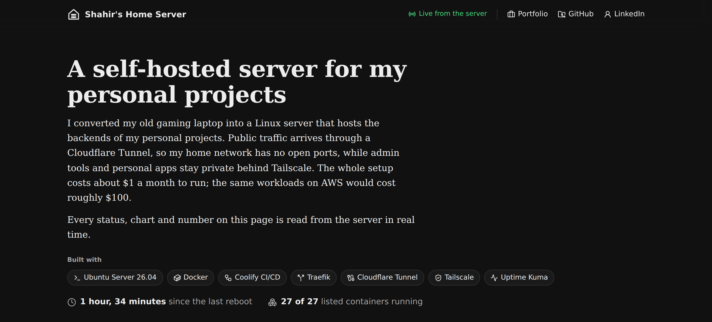
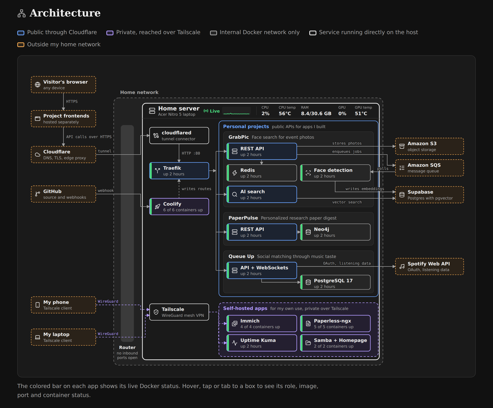
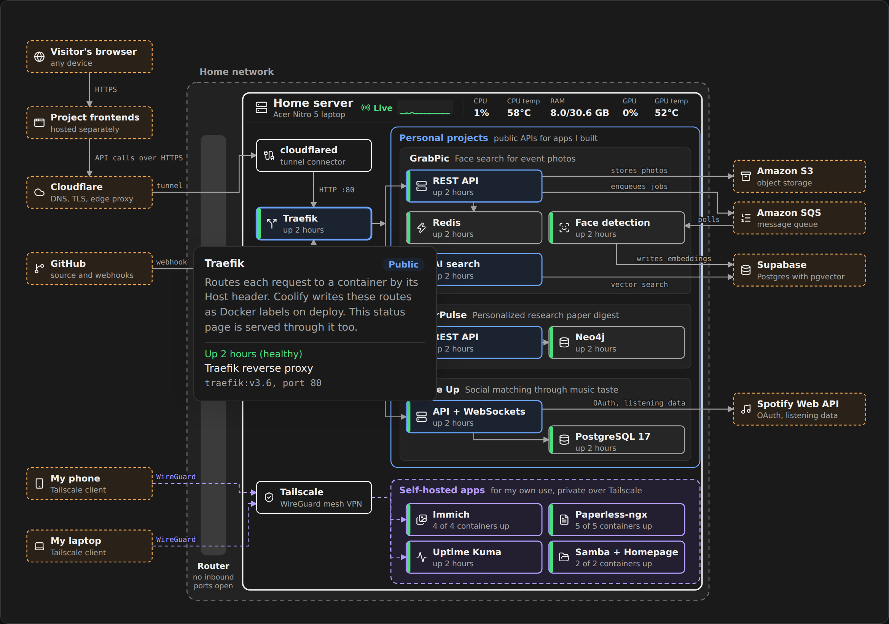
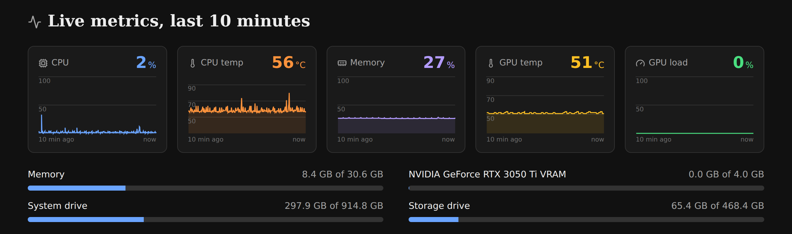
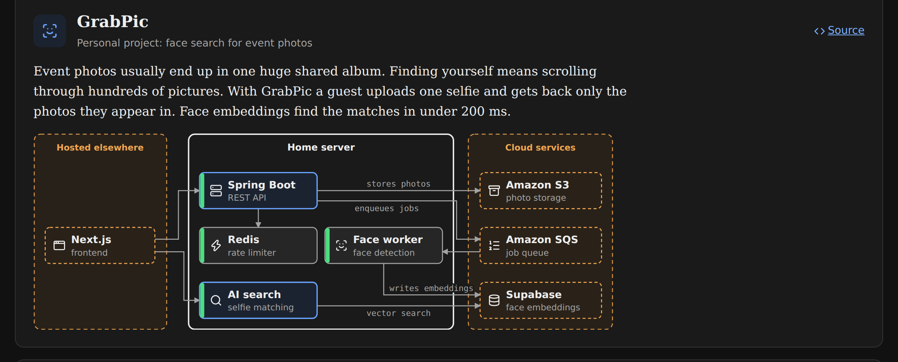
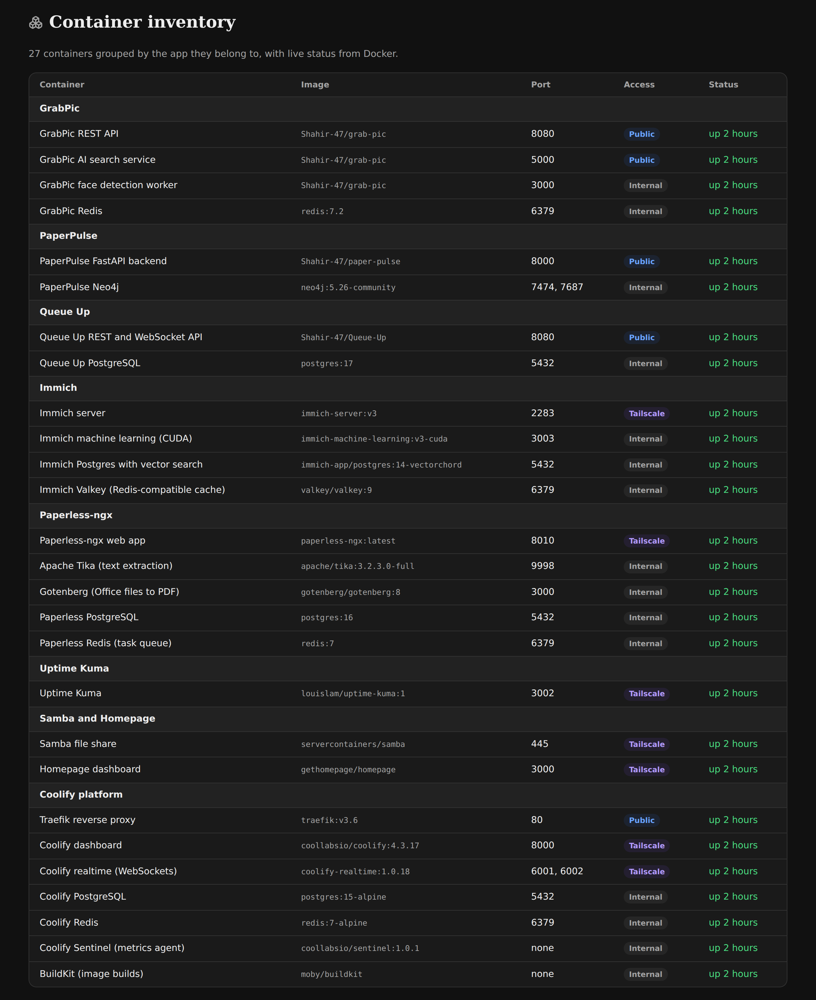

# nitro-lab

Status page for my home server, live at **[lab.shahirahmed.com](https://lab.shahirahmed.com)**.



An old Acer Nitro 5 gaming laptop, running Ubuntu Server with the lid closed. It hosts the backends for my projects and a few apps I keep for myself.

Every number on the page is read off the machine while you have the tab open.

---

## The page

A diagram of the whole system, from a visitor's browser to the containers and out to the cloud services behind them. The stripe on each box is that container's live Docker state.



Hover, tap or tab to a box for its image, port and uptime.



Ten minutes of charts, still filling in as you read.



Each project gets its own diagram.



<details>
<summary>Plus the full container inventory</summary>

<br>



</details>

---

## How it works

One sampler for the whole server. Browsers only listen to it, so fifty open tabs cost the same as one.

| Every | Reads |
| --- | --- |
| 2s | CPU, load, memory, uptime, CPU package temp from `/sys/class/hwmon` |
| 10s | disk usage, `nvidia-smi`, container list |
| 60s | 24-hour uptime from Uptime Kuma |

The last 300 samples stay in memory for the charts. [`instrumentation.js`](instrumentation.js) starts the loop when the server boots, so there's history before the first visitor arrives.

Samples go out over SSE from [`/api/stream`](app/api/stream/route.js), history first, then each new reading. Nothing polls or refreshes.

[`/api/status`](https://lab.shahirahmed.com/api/status) returns one snapshot as JSON:

```console
$ curl -s https://lab.shahirahmed.com/api/status | jq '{cpuPct, cpuTemp, gpu: .gpu.temp}'
{
  "cpuPct": 1,
  "cpuTemp": 57,
  "gpu": 53
}
```

---

## What it's allowed to see

It's a public page reading from a machine in my apartment, so the reach is cut down at every step.

- It never touches the Docker socket. A [socket proxy](https://github.com/Tecnativa/docker-socket-proxy) sits in front with `CONTAINERS=1` and `POST=0`: reads of `/containers`, nothing else.

- Only containers listed in [`lib/site.js`](lib/site.js) are reported. Everything else is dropped on the server.

- The drives are mounted read-only and only get `statfs` called on them, which returns free space and nothing about the files.

- The container runs as a non-root user, and the site is reachable only through the Cloudflare Tunnel. My router has no ports forwarded.

---

## Running it

```sh
npm install
npm run dev
```

Without `DOCKER_PROXY_URL` there's no container data, and the page says so rather than pretending.

`docker compose up -d` brings up the app and the socket proxy together.

| Variable | |
| --- | --- |
| `DOCKER_PROXY_URL` | base URL of the socket proxy |
| `UPTIME_KUMA_URL` | base URL of an Uptime Kuma instance |
| `UPTIME_KUMA_SLUG` | slug of a public status page on it |

Two things are specific to my host: the drive paths in [`lib/sampler.js`](lib/sampler.js), and the NVIDIA Container Toolkit that puts `nvidia-smi` inside the container. Both are safe to drop. The page just skips those cards.

---

## The code

Next.js 16 on the App Router, React 19, plain JavaScript. The only dependency beyond React and Next is `lucide-react`.

```
lib/site.js                   all page content, and the container allowlist
lib/sampler.js                the shared sampling loop
instrumentation.js            starts the loop when the server boots
app/api/stream/route.js       SSE stream
app/api/status/route.js       JSON snapshot
components/SystemMap.js       the architecture diagram
components/ProjectDiagram.js  per-project diagrams
components/Charts.js          charts and usage bars
components/Live.js            EventSource client and helpers
```

Both diagrams are hand-placed SVG on a fixed viewBox. Tedious to move a box, but it scales cleanly and looks like what I drew.

---

## Adding a container

Entries go in [`lib/site.js`](lib/site.js), each with a `match` that ties it to a real container:

```js
{ label: "Queue Up PostgreSQL", match: "queueup-postgres", image: "postgres:17", port: "5432", access: "internal" }
```

Fixed names match in full. Coolify apps are named `<id>-<deploy>`, so those match on the 24-character ID alone.

`access` sets the color: `public`, `private`, `internal`, `host` or `external`.

To put it in the architecture drawing too, it needs a node and coordinates in [`components/SystemMap.js`](components/SystemMap.js).

---

Costs about a dollar a month in electricity. Renting the same machine would be closer to a hundred.
